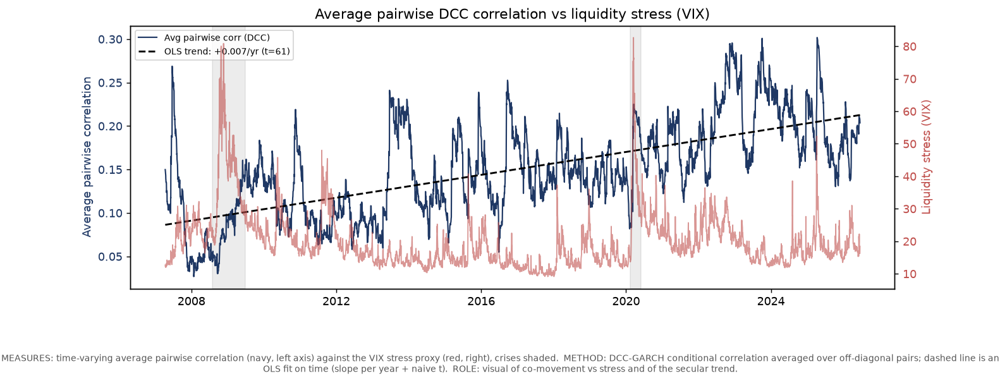

# Stressed Correlation & Liquidity

**Does cross-asset correlation rise with liquidity stress — and does liquidity *lead* correlation?**

The folk wisdom is that in a crisis "everything moves together," so a diversified
book offers no protection when you most need it. The usual mechanism is a liquidity
one: funding shocks force deleveraging and fire sales, so otherwise-unrelated assets
sell off at once (Brunnermeier & Pedersen, 2009). This project measures time-varying
correlation with **DCC-GARCH** and tests, carefully, how much of it actually lines up
with — and is *led by* — market-liquidity stress.

The headline finding is **not** the folk wisdom, and that is the point of the project.

## Headline result

For a genuinely diversified 10-asset basket, the **signed average pairwise
correlation barely moves in stress** — if anything it is slightly *lower* on the
worst-VIX days (regime mean ≈ 0.15 normal vs ≈ 0.13 in the worst decile in this
sample). The naive "correlations spike to 1 in a crisis" story is rejected at the
basket level.

What actually happens is a **cross-sectional split**, not a uniform rise:

- risk-vs-risk pairs (equities, credit, commodities, REITs) **rise** together;
- risk-vs-Treasury pairs **fall** (flight-to-quality decoupling, TLT goes the other way);
- the rates block fragments and investment-grade credit starts behaving like a risk asset.

These offset, so the *signed mean* looks flat. But diversification still erodes — just
measured the right way: **effective number of bets falls and the share of variance in
the first principal component rises** in stress. "Correlations go to 1" is really
**factor concentration**, not a higher average correlation.



> Caveat built into the analysis: correlation has a strong **secular uptrend**, and the
> biggest VIX spikes (2008, 2020) sit in the lower-correlation early years. So the
> headline regression is run **with and without a time-trend control**, and the
> lead-lag question is answered with a **VAR/IRF** (a within-window dynamic that does
> not lean on the trend).

## Method

1. **PCA pre-screen** (`pca_screen.py`) — cluster candidate ETFs by correlation, drop
   near-duplicates, and keep one representative per cluster so the basket is genuinely
   diversified rather than three bets wearing ten tickers.
2. **Univariate GARCH(1,1)** per asset → standardized residuals (strips volatility so
   what remains is co-movement).
3. **DCC** (Engle, 2002) → time-varying correlation matrix; I track average pairwise `rho_t`.
4. **Fisher-z regression** of `arctanh(rho_t)` on liquidity (+ lags), Newey-West/HAC SE,
   **with and without a secular time-trend control**.
5. **Regime test** — average correlation on the worst-liquidity decile vs the rest (Welch t).
6. **Concentration lens** — effective bets (participation ratio) and PC1 variance share,
   normal vs stress, plus PCA loadings to name the risk factors.
7. **VAR / IRF** — does a liquidity shock *precede* a rise in correlation? (Direction via
   Cholesky ordering — see *Limitations*.)

## Data

- **Assets** (yfinance): a PCA-pruned cross-asset basket — broad equity, intl equity,
  REITs, HY & IG credit, commodities, long & inflation-linked Treasuries, gold, USD.
- **Liquidity proxy** (yfinance): VIX as the headline market-liquidity/stress series.
- **Optional funding proxy**: a continuous TED→SOFR **splice** from two local CSVs
  (export from a terminal), z-score or overlap-affine; off by default, enabled via
  `config.FUNDING_SPLICE`.

## Outputs

`python main.py` writes to `outputs/`:

- 8 figures (correlation vs liquidity, regime, dose-response, regime correlation
  matrices, diversification bars, rolling concentration, IRF, PCA loadings),
- `tables.md` plus CSVs (dose-response, normal/stress correlation matrices, per-pair
  Δρ, PCA loadings) so every number in the writeup is reproducible.

`python pca_screen.py` writes the screening figures **and** an interactive,
zero-dependency `outputs/basket_explorer.html` — open it in a browser and drag the
redundancy threshold to re-cut the cluster tree live (its clustering matches scipy
`fcluster`).

## Limitations (read this — it's the point)

DCC-GARCH measures **correlation, not liquidity**. A change in `rho_t` co-moving with
and led by liquidity stress is strong circumstantial evidence of the funding-liquidity
mechanism, but it does **not** prove causation — a common fundamental shock could drive
both. A clean causal claim would need an *identified* exogenous liquidity shock. The
VAR/IRF also depends on the Cholesky ordering (liquidity ordered first as more
exogenous); check robustness by flipping it.

## Run

```bash
pip install -r requirements.txt
python pca_screen.py        # basket screen + interactive explorer
python main.py --simulate   # offline demo on synthetic data
python main.py              # real data via yfinance
```

## Structure

```
config.py            tickers, liquidity proxies, dates, crisis windows, funding splice
pca_screen.py        PCA/correlation basket screen + interactive HTML explorer
src/data_loader.py   yfinance loader, CSV liquidity, TED->SOFR funding splice
src/dcc_garch.py     univariate GARCH + DCC correlation recursion
src/analysis.py      Fisher-z regression (+trend), regime test, concentration, PCA, VAR/IRF
src/viz.py           figures (all with method/role caption strips)
src/export.py        auto-export of results to markdown + CSV
main.py              end-to-end pipeline
THESIS.md            the writeup as a logical argument
THEORY.md            full math appendix (GARCH/DCC/Fisher-z/PCA/VAR derivations)
FIGURE_GUIDE.md      what each figure measures and how to read it
```

## References

- Engle (2002), *Dynamic Conditional Correlation*, JBES.
- Brunnermeier & Pedersen (2009), *Market Liquidity and Funding Liquidity*, RFS.
- Cappiello, Engle & Sheppard (2006), asymmetric dynamics in correlations.
- Forbes & Rigobon (2002), *No Contagion, Only Interdependence*, J. Finance.
- Meucci (2009), *Managing Diversification* (effective number of bets).
